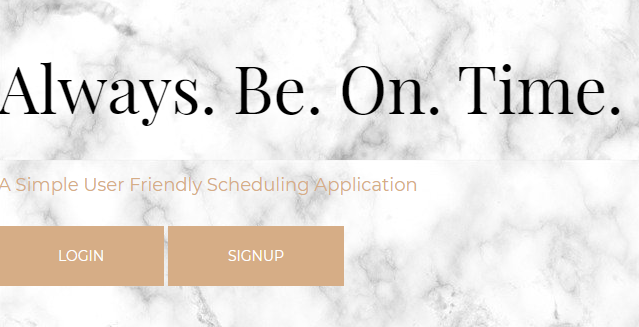
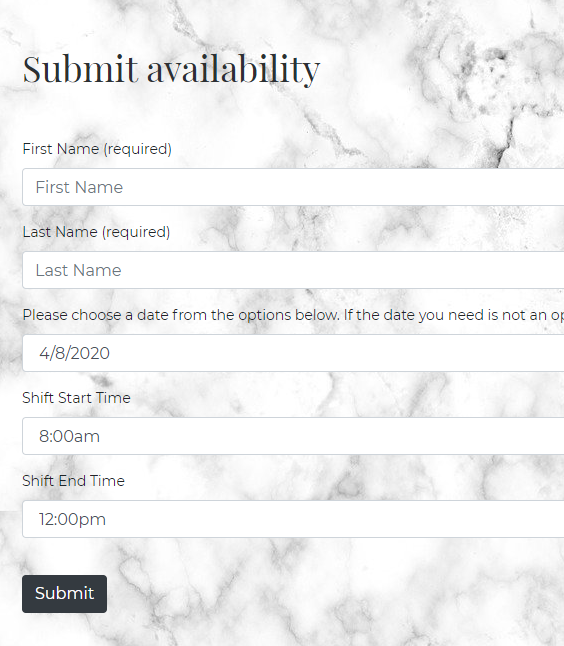
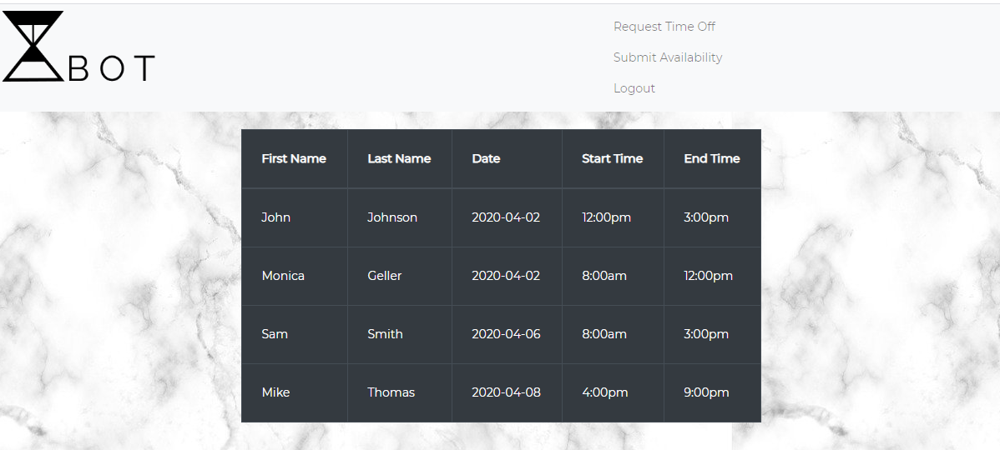
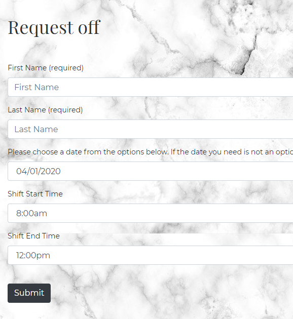
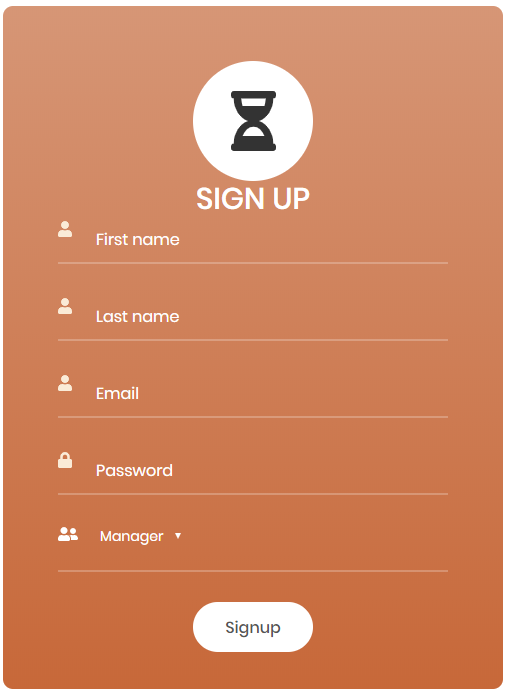

# Always. Be. On. Time.
User friendly scheduler at your convenience. Stay up to date with your work schedule, your time off requests and your team's work schedule. 

 

## How it works:

Simply login and you have access to:

Submit availability 
 

View you and your team's availability in ascending order of dates 
 

Request off 
 

### Don't have an account? 
Just click Sign Up and you can create an account.

 

Mobile friendly and you will *always be on time!*

Check it out here: 

## Technologies used

### Front End 
* HTML
* CSS
* JQuery
* Bootstrap
### Back End 
* Node.js
* Express
* Express-session 
* Passport.js
* bCrypt
* MySQL
* Sequalize

Learn about our motivation and possible future developments: https://docs.google.com/presentation/d/1V575YpgOxrLqJHyG1Bb-LuMvrE7aMmrmb8zwXNq5Tto/edit?usp=sharing

## Contributors:
Hallie Weintraub https://github.com/hallieraew  
Alicia Forstner https://github.com/forsa9828 
Mai Houa Vue https://github.com/mhvue 

